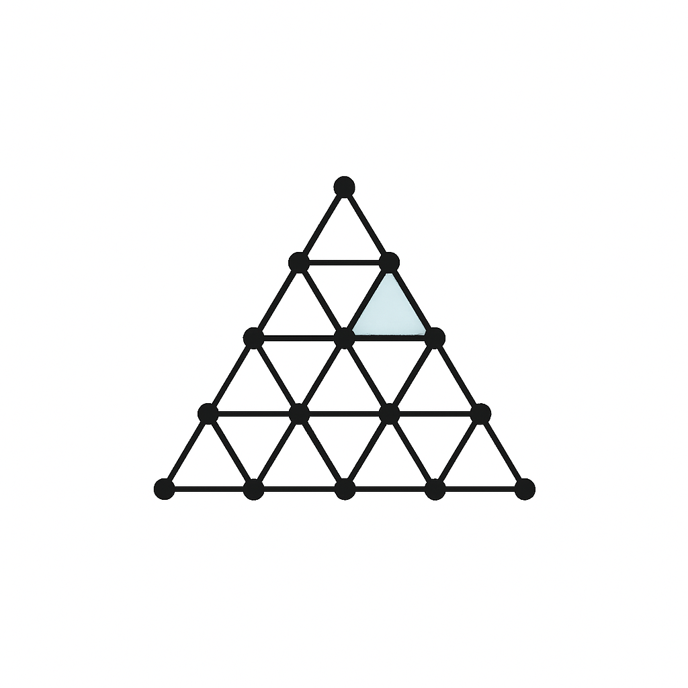

# tonnetz

<p align="center">
  
</p>

[](https://github.com/amaar-mc/tonnetz/actions/workflows/ci.yml)
[](./LICENSE)

Neo-Riemannian music theory for JavaScript and TypeScript: the P, L, R transformations, hexatonic and octatonic cycles, the Tonnetz lattice, and shortest transformation paths between triads. Typed, zero runtime dependencies, runs in the browser and in Node.

## Install

```sh
npm install tonnetz
```

## 30-second example

```ts
import { triad, p, l, r, transform, hexatonicPole, pathBetween, triadName } from "tonnetz";

const c = triad(0, "major");        // C major

p(c);                                // { root: 0, quality: "minor" }   C minor
l(c);                                // { root: 4, quality: "minor" }   E minor
r(c);                                // { root: 9, quality: "minor" }   A minor

triadName(hexatonicPole(c));         // "G# minor"  (no common tones)
triadName(transform(c, "LPR"));      // "C# minor"  (apply L, then P, then R)

pathBetween(c, triad(5, "minor"));   // "PLR"  shortest route to F minor
```

Triads are `{ root, quality }` with root a pitch class (0..11, C = 0). All functions are pure.

## Why this exists

Neo-Riemannian theory (the PLR transformations and the Tonnetz) is standard in modern
music theory, but there is no JavaScript or TypeScript library for it. `tonal` covers
tonal harmony but not transformational theory; `Tone.js` is for audio; `music21` is a
large Python framework that does not run in a browser. `tonnetz` fills that gap with a
small, correct, dependency-free engine, well suited to interactive teaching tools and
analysis.

## Comparison

| Capability                  | tonnetz | tonal | music21 |
|-----------------------------|:-------:|:-----:|:-------:|
| P, L, R transformations     |   yes   |  no   |   yes   |
| Compound transformations    |   yes   |  no   |   yes   |
| Hexatonic / octatonic cycles|   yes   |  no   | partial |
| Shortest PLR path           |   yes   |  no   |   no    |
| Tonnetz lattice coordinates |   yes   |  no   |   no    |
| Zero runtime dependencies   |   yes   |  yes  |   no    |
| Runs in the browser         |   yes   |  yes  |   no    |
| Language                    |   TS    | JS/TS | Python  |

## API

### Triads

- `triad(root, quality)` constructs a triad, reducing the root modulo 12.
- `triadToPitchClasses(t)` returns the three pitch classes.
- `isConsonantTriad(pcs)` identifies a pitch-class set as a major or minor triad, or null.
- `triadName(t)` returns a readable name such as "C major".
- `allTriads()` returns all 24 consonant triads.
- `triadsEqual(a, b)` compares root and quality.

### Transformations

- `p(t)`, `l(t)`, `r(t)` are the Parallel, Leittonwechsel, and Relative transformations.
- `transform(t, "LPR")` applies a sequence of operations, left to right.
- `hexatonicPole(t)` returns the maximally distant triad (LPL).

### Cycles and paths

- `hexatonicCycle(t)` returns the six triads of the hexatonic cycle.
- `octatonicCycle(t)` returns the eight triads of the octatonic cycle.
- `pathBetween(from, to)` returns the shortest P, L, R sequence mapping one triad to another.

### Geometry and relations

- `commonTones(a, b)` counts shared pitch classes.
- `pitchAtLattice(fifths, majorThirds)` maps a Tonnetz lattice coordinate to a pitch class.

## The transformations

- P (Parallel) swaps quality on the same root: C major to C minor.
- L (Leittonwechsel): C major to E minor, A minor to F major.
- R (Relative): C major to A minor, A minor to C major.

Each preserves exactly two common tones, and each is its own inverse. Together they
generate the dihedral group of order 24 acting on the 24 consonant triads, which is why
a path always exists between any two triads. These properties are tested.

## Roadmap

- Named compound transformations (N, S) with documented definitions.
- Seventh-chord transformations.
- Triad and chord name parsing.
- Tonnetz triangle coordinates for rendering.

## Examples

```sh
npm run example
```

## Testing

```sh
npm test
```

Tests cover the exact textbook transformations and group-theoretic invariants
(involutions, the two-common-tone property, and that every shortest path actually maps
its source onto its target across all 24 triads).

## Contributing

Issues and pull requests are welcome. See [CONTRIBUTING.md](./CONTRIBUTING.md).

## License

MIT. See [LICENSE](./LICENSE).
